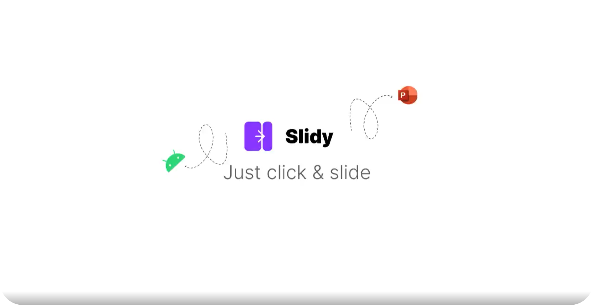

# Slidy
Offline controller for your PowerPoint presentation.

# How it works
- The application relies on a websocket server that is created when you open the mobile application. When you click "connect" on the powerpoint plugin, the plugin will be connected to the websocket server. The phone will act as a server and a client such that the plugin and the mobile application will exchange messages to preform  certain actions like going to the next slide or going back to the previous slide.

- The application is highly extentensibole, sol you can take advantages from the `office.js` available methods and associate them to certain messages to make custom actions.
# Guide
- The project in composed from two directories :
    1. `./PowerPoint Plugin` : contains the plugin that will allow us to manipulate the presentation.
    2. `./Slidy Android App` : is the android application that will be responsible for controlling the presentation remotly.

- To run the application :
    1. Make sure to activate plugins in PowerPoint.
    2. navigate to `./PowerPoint Plugin` (you can use `cd ./PowerPoint Plugin`) and run `npm install`. When all the packages are installed, execute `npm start`. At this point, a PowerPoint instance will be created and the plugin will appears in a side panel.
    3. Click on inspect in the side panel, and navigate to 
    `https://{your_phone_ip_address}:8887`. Click on that link and accept the certificate. This is necessary, because PowerPoint plugins doesn't allow connection over http, so I used a **self-signed-certificate** to create an https server on the phone. Note : your ip address will show up in the mobile application.
    4. Open `./Slidy Android App` in android studio and build the application. 